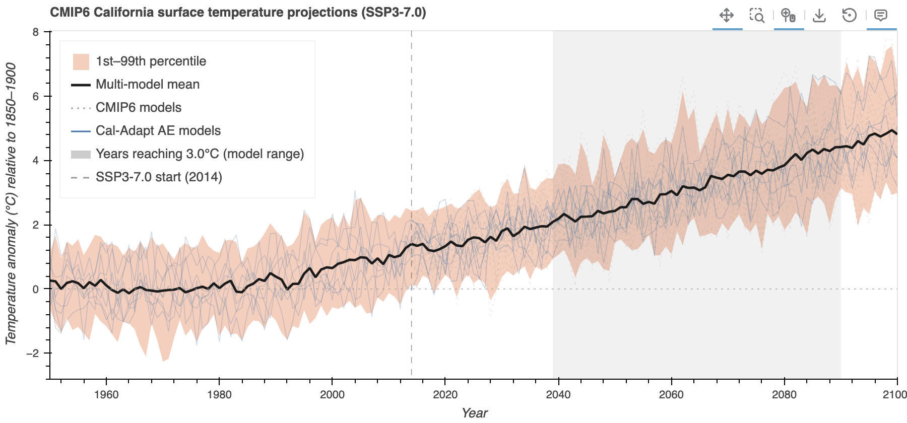
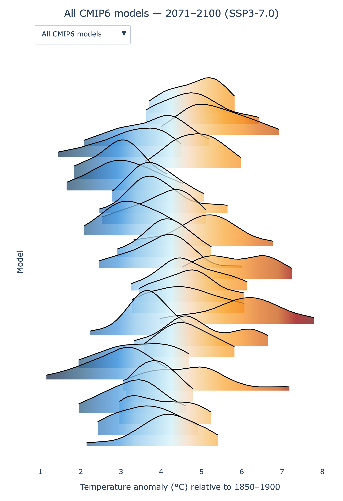
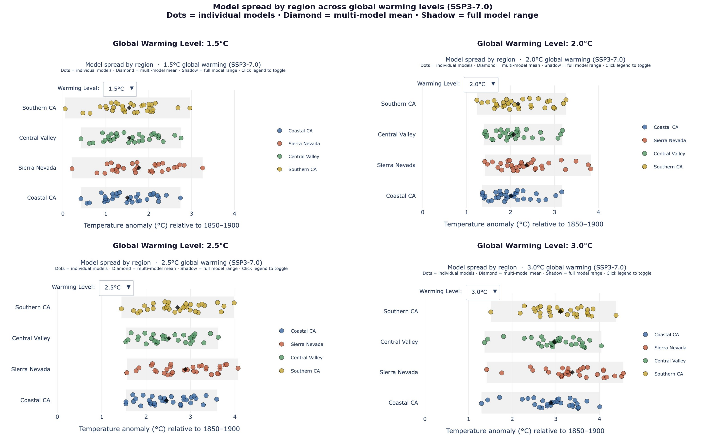
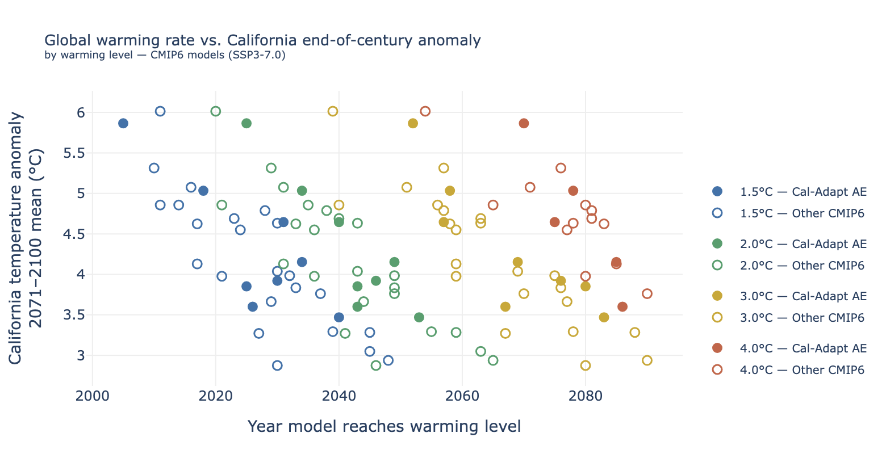
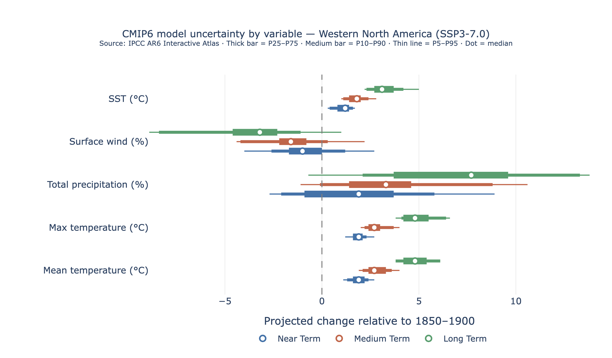

# What is model uncertainty?

Global climate models (GCMs) are complex mathematical representations of Earth's atmosphere, ocean, land surface, and sea ice, designed to simulate the physical processes that govern climate. Because no single model can perfectly capture the full complexity of the climate system, researchers have long recognized the value of using multiple models. Multi-model ensembles — collections of simulations from different modeling centers around the world — allow scientists to sample a broader range of structural assumptions, parameterization schemes, and numerical approaches, providing a more robust picture of both the mean climate state and its uncertainty.

The use of multi-model data has become a cornerstone of modern climate science, most notably through coordinated international efforts like the [Coupled Model Intercomparison Project (CMIP)](https://wcrp-cmip.org/). By comparing and combining outputs from dozens of independently developed models, researchers can identify areas of strong agreement — which boosts confidence in projected outcomes — as well as areas of divergence, which highlight key uncertainties. This approach not only improves the reliability of global projections but also underpins the assessment reports of the [Intergovernmental Panel on Climate Change (IPCC)](https://www.ipcc.ch/), making multi-model analysis essential for translating climate science into actionable policy guidance.

Model uncertainty reflects the fact that different modeling groups make different scientific choices about how to represent complex climate processes. Each model is a legitimate tool built on valid physical principles; the spread between them captures the range of outcomes that current science considers plausible. The appropriate response is to characterize that range honestly, communicate it clearly, and design decisions that are robust across it.

::: {.callout-note title="IPCC AR5 Guidance Note (Mastrandrea et al. 2010)"}
"Sound decision-making that anticipates, prepares for, and responds to climate change depends on information about the full range of possible consequences and associated probabilities… Low-probability outcomes can have significant impacts, particularly when characterized by large magnitude, long persistence, broad prevalence, and/or irreversibility."
:::

# What CMIP6 models are used in these analyses?

All analyses on this page use monthly near-surface air temperature (*tas*) and precipitation (*pr*) from the CMIP6 archive for models that provide both a *historical* simulation (1850–2014) and a *future* simulation under SSP3-7.0. Data are subsetted to California and expressed as **anomalies relative to the 1850–1900 pre-industrial baseline**, placing results directly in the [global warming levels](https://analytics.cal-adapt.org/guidance/about_climate_projections_and_models#what-are-global-warming-levels) (GWL) framework used by the IPCC AR6.

Within the broader CMIP6 archive, the Cal-Adapt Analytics Engine uses a curated subset of eight models that meet bias-adjustment criteria and provide output at sufficient spatial resolution for California impact assessments: `FGOALS-g3`, `EC-Earth3-Veg`, `CESM2`, `CNRM-ESM2-1`, `MIROC6`, `MPI-ESM1-2-HR`, `EC-Earth3`, and `TaiESM1`. Analyses on this page show results for both the full available CMIP6 archive and this AE subset, so users can see how the curated eight compare to the broader distribution.


# How does model uncertainty change over time?

::: {#fig-plume}
::: {.content-visible when-format="html"}
```{=html}
<div class="figure-container">

</div>
```
:::
::: {.content-visible when-format="pdf"}

:::
**CMIP6 California surface temperature projections (SSP3-7.0).** Individual CMIP6 model timeseries of California-mean near-surface air temperature anomaly relative to 1850–1900, under SSP3-7.0. The shaded envelope spans the 10th–90th percentile of the full archive; the bold line is the multi-model mean. Blue traces are the eight Cal-Adapt AE models. The vertical grey band indicates the spread of years in which models reach the selected warming level.
:::

A few things are worth noting when reading @fig-plume:

**The spread grows with time.** In the historical period (before 2015), model traces are tightly clustered because all models are constrained by the same observed climate. After 2015, the traces fan out as both scenario and model differences compound. By end of century, the range between the warmest and coolest models for California can exceed 3–4°C — a difference that is highly consequential for planning.

**The warming-level band.** The grey shaded vertical band marks the range of calendar years in which different models reach the selected global warming level (e.g., 3°C above pre-industrial). Fast-warming models reach it decades earlier than slow-warming models. This spread in timing is itself a form of model uncertainty — in the global climate sensitivity — and it means that time-based analyses (e.g., "mid-century") mix models at very different stages of their warming trajectories. The [global warming levels framework](https://analytics.cal-adapt.org/guidance/about_climate_projections_and_models#what-are-global-warming-levels) avoids this problem by anchoring comparisons to physically comparable climate states rather than calendar years.

**The multi-model mean is not a best estimate.** The multi-model mean (MMM) is a useful summary of the ensemble's central tendency, and in hindcast evaluations it often outperforms any individual model. However, treating the MMM as a *best estimate* in a planning context is inappropriate for two reasons. First, it can mask bimodal distributions, where models cluster in two groups with qualitatively different outcomes and the mean falls between them. Second, and more fundamentally, it discards the range — which is often the most important information for risk-based decisions. The IPCC guidance is explicit: information on the tails of the distribution should always be reported alongside any central estimate.


# What does the spread look like by the end of century?

::: {#fig-ridgeline}
::: {.content-visible when-format="html"}
```{=html}
<div class="figure-container">

</div>
```
:::
::: {.content-visible when-format="pdf"}

:::
Kernel density estimates of annual California-mean temperature anomaly (relative to 1850–1900) for each CMIP6 model over the 2071–2100 period, under SSP3-7.0. Each ridge is one model. The dashed line marks the median of each distribution. Colors shift from cooler (blue) to warmer (red) with increasing mean anomaly.
:::

@fig-ridgeline shifts from a temporal view to a distributional one. Each ridge shows what one model's range of outcomes looks like by the end of century. Two key features to note:

- **Within-model spread** (ridge width): how much year-to-year variability a given model produces within the period. Wide ridges indicate high internal variability in that model's simulation.
- **Between-model spread** (offset of medians between ridges): structural model uncertainty — the quantity that cannot be reduced by running any single model longer.


# How does the specific location influence the model uncertainty?

::: {#fig-dots}
::: {.content-visible when-format="html"}
```{=html}
<div class="figure-container">

</div>
```
:::
::: {.content-visible when-format="pdf"}

:::
Temperature anomaly at the selected global warming level for each California sub-region, disaggregated by model. Each dot is one model; the diamond is the multi-model mean; the shaded rectangle spans the full range. Use the warming level selector to compare 1.5°C, 2°C, and 3°C.
:::

As shown in @fig-dots, the entire distribution shifts right from 1.5°C to 3.0°C, as expected. But the shift is not uniform across regions:

- **Southern CA and Sierra Nevada consistently show the widest spread** — the grey shadow is notably longer for these regions than for Coastal CA. This means model choice has a larger absolute impact on exposure estimates in these regions. For water supply and fire risk assessments in the Sierra Nevada, the difference between the warmest and coolest models can exceed 2°C at 3.0°C GWL.
- **Coastal CA has the tightest model agreement**, possibly meaning that the ocean moderates the warming signal and inter-model spread. **The spread grows with warming level** — at 1.5°C the distributions are relatively compact; by 3.0°C they fan out considerably. This is the visual demonstration that structural model uncertainty compounds over time and with forcing level.
- **Some models are consistently outliers** — looking across panels, the leftmost and rightmost dots in each region tend to be the same models across warming levels. This suggests some models are systematically cooler or warmer for California regardless of the warming level, which reflects persistent differences in regional climate sensitivity across model families.
- **The MMM shifts right faster in interior regions** — comparing the diamond position relative to the x-axis across regions, Southern CA and Sierra Nevada warm faster than Coastal CA per degree of global warming. This amplification of regional warming relative to the global mean is a robust feature across models.


# Relationship between warming rate and end-of-century anomaly.

::: {#fig-wl_scatter}
::: {.content-visible when-format="html"}
```{=html}
<div class="figure-container">

</div>
```
:::
::: {.content-visible when-format="pdf"}

:::
Global warming rate (x-axis: year the model reaches the selected warming level) versus California end-of-century temperature anomaly (y-axis), for each CMIP6 model under SSP3-7.0. Colors indicate warming level. Filled circles are Cal-Adapt AE models; open circles are other CMIP6 models.
:::

As shown in @fig-wl_scatter, there is not a definite correlation between end-of-century temperature anomaly and the year a model reaches a given warming level. You might expect that a model reaching, say, 3°C in California earlier would also project higher end-of-century California temperatures — but the scatter shows this is not consistently the case. A model can warm California quickly to a threshold and then level off, or warm it slowly but continue accelerating late in the century.

This suggests that the rate at which California reaches a warming level is not a reliable predictor of where it ends up by 2100 — the two are driven by partially independent aspects of each model's behavior (early forcing response vs. late-century trajectory).

This is a manifestation of **structural model uncertainty**: different models have different sensitivities and feedbacks that govern their warming trajectories, and these differences do not necessarily align with global warming rates.


# Are all climate variables equally uncertain?

No. Model uncertainty varies substantially across variables.

::: {#fig-ipcc_atlas_uncertainty}
::: {.content-visible when-format="html"}
```{=html}
<div class="figure-container">

</div>
```
:::
::: {.content-visible when-format="pdf"}

:::
CMIP6 inter-model spread by variable, Western North America (SSP3-7.0). Projected changes in mean temperature, maximum temperature, total precipitation, surface wind speed, and sea surface temperature (SST) for Western North America under SSP3-7.0, across near-term (2021–2040), medium-term (2041–2060), and long-term (2081–2100) periods, relative to the 1850–1900 pre-industrial baseline. Each bar summarizes the CMIP6 multi-model distribution: the thick bar spans the 25th–75th percentile (interquartile range), the medium bar spans the 10th–90th percentile, and the thin whisker spans the 5th–95th percentile; the dot marks the median. The dashed vertical line at zero indicates no change. Temperature and SST distributions sit entirely above zero at all time horizons, indicating robust model agreement on warming. Total precipitation distributions cross zero at all time horizons, indicating that models do not agree on the direction of change. Source: IPCC AR6 Interactive Atlas (Gutiérrez et al., 2021).
:::

@fig-ipcc_atlas_uncertainty shows CMIP6 model uncertainty for five climate variables in Western North America under SSP3-7.0, across three time horizons.

::: {.panel-tabset}

## Air Temperature & SST

**High confidence, robust signal.** Mean temperature, max temperature, and SST all show tight distributions that sit entirely to the right of zero across all three periods. The IQR (thick bar) is narrow relative to the median, and all models agree on the direction of change — warming is virtually certain. The spread grows modestly from near-term to long-term, but remains well-constrained. This supports high confidence in both the direction and approximate magnitude of warming.

## Precipitation

**Low confidence, sign uncertainty.** Total precipitation has by far the widest distribution of any variable. At all three time horizons the P5–P95 whisker crosses zero, meaning some models project drying while others project wetting. The long-term median is positive (~+8%) but the lower tail extends below zero (-0.7% at P5), confirming that even by end of century the direction of change is not robust across the full ensemble. The spread is disproportionately large relative to the median signal.

## Surface Wind

**Moderate spread, consistent drying signal.** Wind shows a consistent negative signal (decreasing surface wind speeds) across all periods, with the long-term distribution entirely below zero at the P25–P75 level. However, the P5–P95 range crosses zero for near- and medium-term periods, indicating lower confidence at shorter horizons. By the long term, confidence in the direction increases.

:::

**The contrast grows over time**: For temperature variables, the distributions shift right and remain tight — the signal-to-noise ratio improves with time. For precipitation, the distributions widen substantially from near-term to long-term without a proportional increase in the median — uncertainty accumulates faster than the signal strengthens.


# How should users communicate uncertainty in their analyses?

The IPCC AR5 guidance framework (Mastrandrea et al. 2010) offers two calibrated metrics for communicating certainty in climate findings:

- **Confidence** (qualitative): synthesizes the type, amount, quality, and consistency of evidence and the degree of agreement among models and studies. Expressed as *very low, low, medium, high,* or *very high.*
- **Likelihood** (quantitative): expresses a probabilistic estimate of an outcome. Expressed using calibrated language such as *virtually certain* (99–100%), *very likely* (90–100%), *likely* (66–100%), *about as likely as not* (33–66%), *unlikely* (0–33%).

Users should report these distinctions explicitly, rather than presenting the multi-model mean alone. Where confidence is low — particularly for precipitation — it is important to explain *why* confidence is low (model disagreement on direction, not data limitations) and to present the full range rather than a single number.

::: {.callout-tip title="A practical rule of thumb"}
- For **temperature-driven questions**: the MMM is a defensible central estimate; the 10th–90th percentile envelope captures the planning range.
- For **precipitation-driven questions**: always use the full model ensemble; the MMM alone discards critical information about sign uncertainty.
- For **compound questions** (heat *and* drought, heat *and* flood): preserve the full joint distribution of temperature and precipitation across models; do not select on either variable independently.
:::


# Key takeaways

- Model uncertainty represents genuine scientific disagreement about climate system behavior. It is a property of the science, not a limitation of the Analytics Engine tools.
- For California temperature, model uncertainty is relatively well-characterized: models agree on the direction of change with high confidence, and the multi-model mean is a useful summary when accompanied by the ensemble range.
- For California precipitation, model uncertainty is large enough that models often disagree on the direction of change. In these cases, the multi-model mean can be misleading, and the full ensemble range is essential.
- Model uncertainty is not uniform — it varies by variable, region, and time horizon, and treating it as a single problem leads to unreliable decisions.
- The spread between models grows over time. Planning for longer time horizons requires engaging with a wider range of possible futures, not narrowing to a single projection.
- Uncertainty should be communicated using calibrated language consistent with IPCC practice: confidence levels for qualitative assessments and likelihood language for probabilistic ones. Reporting only the multi-model mean without the range does not meet this standard.


# References

- Mastrandrea, M.D., et al. (2010). *Guidance Note for Lead Authors of the IPCC Fifth Assessment Report on Consistent Treatment of Uncertainties.* Intergovernmental Panel on Climate Change (IPCC).
- Gutiérrez, J.M., et al. (2021). *IPCC AR6 Interactive Atlas.* In: Climate Change 2021: The Physical Science Basis. <https://interactive-atlas.ipcc.ch/>
- World Climate Research Programme. *Coupled Model Intercomparison Project (CMIP).* <https://wcrp-cmip.org/>
- Intergovernmental Panel on Climate Change (IPCC). <https://www.ipcc.ch/>
- Cal-Adapt Analytics Engine. *About Climate Projections and Models — Global Warming Levels.* <https://analytics.cal-adapt.org/guidance/about_climate_projections_and_models#what-are-global-warming-levels>
